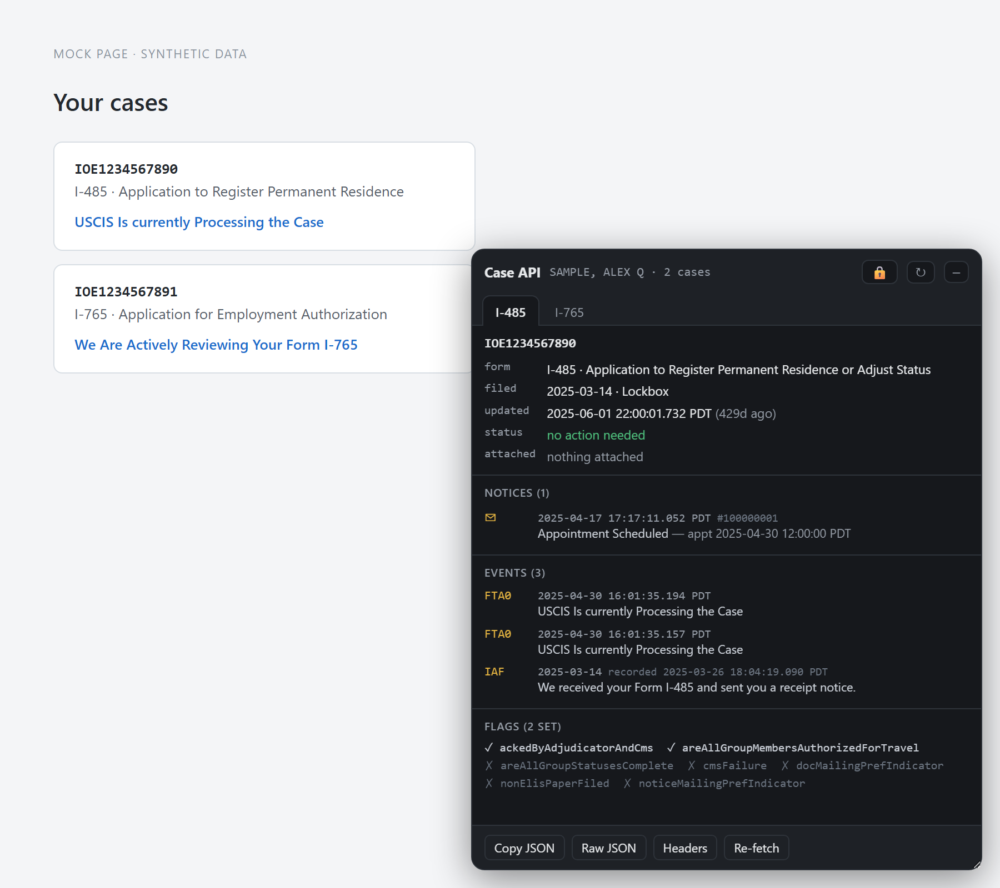

# USCIS Case Viewer

A Chrome extension that shows the full details my.uscis.gov already has about
your cases, but doesn't put on screen — exact timestamps, notices, the internal
event history, and status flags.

*Screenshot uses made-up data — the receipt numbers, name and dates aren't real.*

It reads the responses your own signed-in session already receives. Nothing is
sent anywhere, and there's no account or sign-in of its own.

## Install

1. Open `chrome://extensions`
2. Turn on **Developer mode** (top right)
3. Click **Load unpacked** and select this folder

Keep the folder where it is — Chrome loads it from that location every time it
starts, so moving or deleting it breaks the extension.

## Using it

Go to [my.uscis.gov](https://my.uscis.gov), sign in, and open your cases. A panel
appears in the bottom-right corner.

> **Already had the tab open?** Reload it. The extension has to be in place
> before the page loads.

Each of your cases gets a **tab**, labelled by form type. Click between them.
The panel finds your cases on its own — you don't have to tell it anything.

- **–** collapses the panel to a small button; it stays that way until you
  reopen it
- **↻** looks for new cases
- **🔒** shows the security headers behind each request (hidden by default so
  screenshots are safe)
- Drag the bottom-right corner to resize

### What each case shows

Three things sit at the top, in larger type, because they're what you actually
check:

| | |
| --- | --- |
| **Status** | Whether anything is needed from you |
| **Last updated** | How long since the record changed, with the exact time beneath |
| **Location** | The USCIS office handling the case (e.g. National Benefits Center) |

Then the rest:

| Section | What's in it |
| --- | --- |
| **Details** | Form type and full name, and when you filed |
| **Notices** | Letters USCIS generated, including appointment dates |
| **Events** | The internal history of the case, newest first |
| **Flags** | Yes/no markers USCIS tracks internally |

**Events** is usually the interesting part. It's the case history at full
precision, including entries the website's status text doesn't mention. Each row
shows a short code (`FTA0`, `IAF`) and USCIS's own description of it. Some codes
have no published description — those say so rather than guessing.

Times are shown in your local timezone. If USCIS entered a record later than the
date it applies to, the row notes when it was actually recorded.

The buttons along the bottom:

- **Copy JSON** — bundles the raw `/cases/{receipt}` and `/case_status/{receipt}` responses
- **Raw JSON** — shows that same two-response bundle; **Headers** shows the case-detail headers
- **Re-fetch** — reload that case

## Your data

- Everything stays in your browser. The extension has no server and sends
  nothing anywhere.
- Data is held in memory only and disappears when you close Chrome.
- The panel shows the name on the application, so be mindful when screen-sharing.
- **Copy JSON** and **Download JSON** include your session token. Treat anything
  you paste or save from those like a password.

## The toolbar popup

Clicking the extension icon opens a developer-oriented view: every captured API
call, with request and response headers, a copy-pasteable `curl` command, a
replay button, and a box for calling other endpoints by hand. Most people won't
need it — the panel is the main interface.

## If nothing appears

- **Reload the USCIS tab.** This fixes it most of the time.
- **Make sure you're signed in** and on a page that shows your cases.
- **After changing any extension file**, click the reload arrow on
  `chrome://extensions` *and* reload the USCIS tab.

If a case shows *No details available* or *Signed out*, that's USCIS's response,
not a bug in the extension — hover the message for the technical detail.
